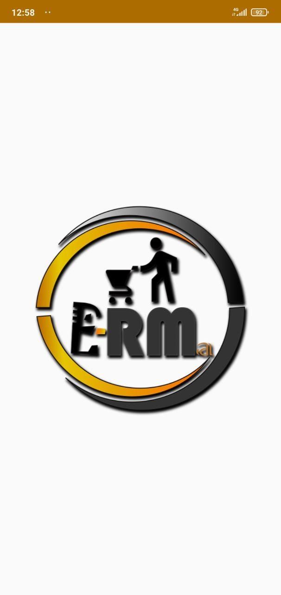
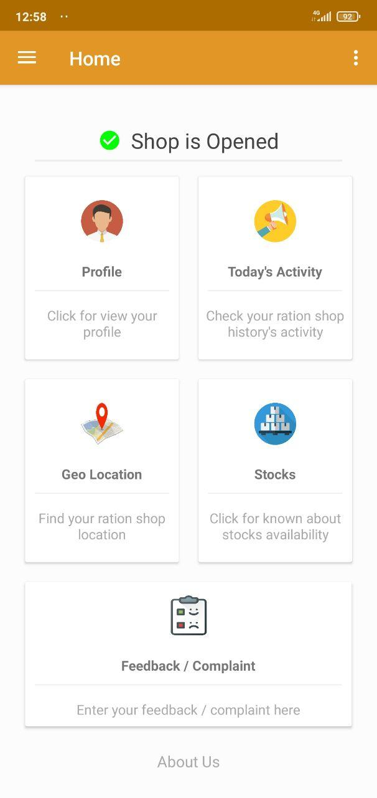
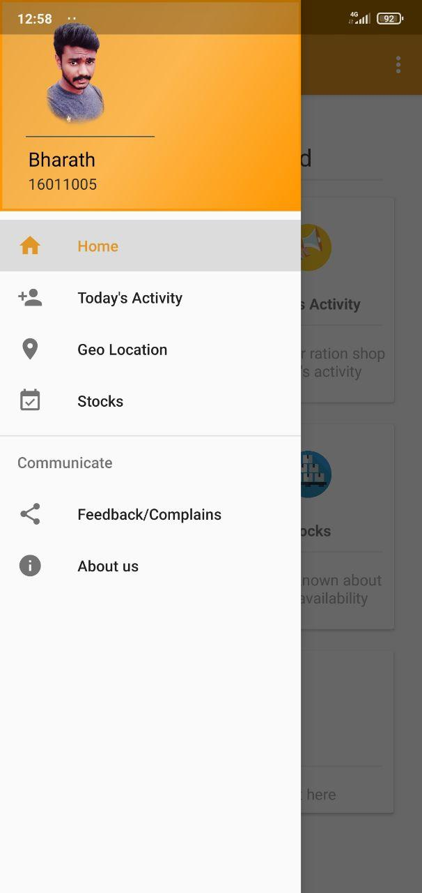
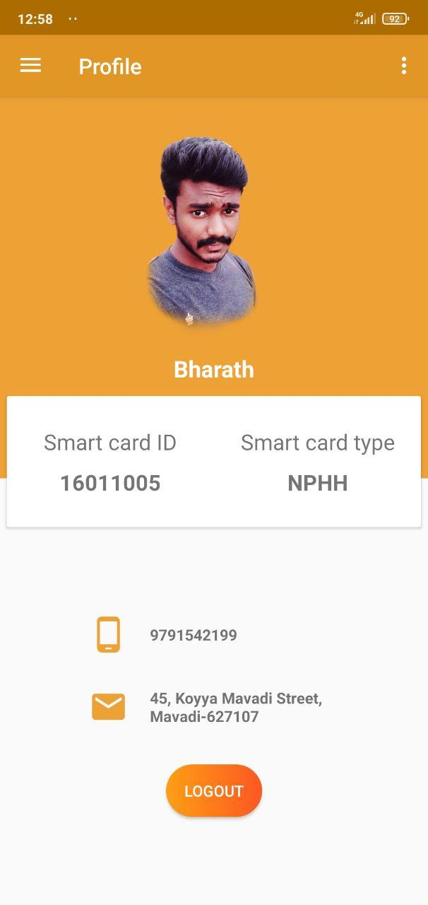
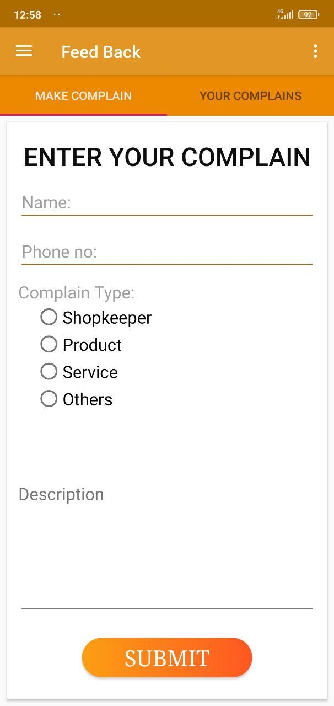

# E-Ration-Mobile-App-Using-Firebase
An Android app that will help to replace the Traditional way of getting information and ration items in Ration shop’s. This app will provide better functionalities like decent UI, management, feedback and provide Notification for the updates.
## PROPOSING SYSTEM
### Our Proposed system will provide :
Timely notification on updates about the stock available in current date.
### Also provide :
1. Geo-location.
2. Todays Activity
3. Stock Availability
4. Complaint forum 
5. My Profile

## Screen Shots

      
   

